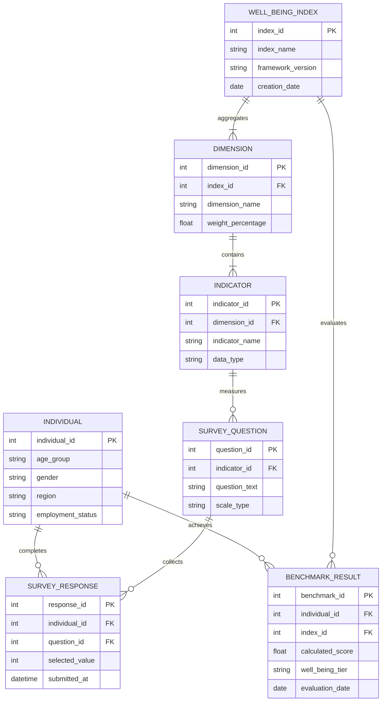

# A Comprehensive Measure of Well-Being

An end-to-end framework and data architecture designed to quantify, analyze, and track multi-dimensional human well-being. This project establishes a composite index by gathering demographic-linked survey insights and mapping them against structural quality-of-life indicators.

## 📌 Project Overview

Traditional metrics like GDP often fail to capture true human prosperity. This project builds a data model to evaluate well-being holistically across several life dimensions (e.g., mental health, financial resilience, and social connectivity). By combining structured surveys with an algorithmic weighting system, the platform generates a dynamic **Well-Being Index** score for individuals and populations.

---

## 📊 Data Architecture (ERD)


The repository utilizes an Entity-Relationship model designed for relational databases (PostgreSQL/MySQL) to capture framework structures, survey items, user metrics, and final scoring benchmarks.



---

## 🔑 Key Entity Descriptions

*   **`INDIVIDUAL`**: Stores anonymized demographic metadata used to segment and analyze well-being trends across different regions and backgrounds.
*   **`WELL_BEING_INDEX`**: Holds version control configurations for the overarching math framework.
*   **`DIMENSION`**: Categorizes broad sectors of life quality (e.g., Physical Health, Financial Stability, Social Connection) and assigns thematic weights.
*   **`INDICATOR`**: Breaks down dimensions into specific measurable metrics (e.g., Stress Levels, Disposable Income).
*   **`SURVEY_QUESTION`**: Houses individual Likert-scale questions utilized to harvest empirical data.
*   **`SURVEY_RESPONSE`**: Captures raw user-submitted responses linkable back to user demographic brackets.
*   **`BENCHMARK_RESULT`**: Computes, updates, and indexes the individual's definitive well-being score alongside descriptive classifications (e.g., *Thriving*, *Struggling*).

---

## 🚀 Getting Started

### Prerequisites
*   A relational database manager (e.g., **PostgreSQL 15+** or **MySQL 8.0+**).
*   A data visualization tool or notebook backend (e.g., **Python 3.10+**, **Tableau**, or **PowerBI**) to consume the computed scores.

### Installation & Initialization
1. Clone this repository:
   ```bash
   git clone https://github.com
   cd well-being-measure
   ```
2. Set up the schema inside your database target:
   ```bash
   # Example if using PostgreSQL CLI
   psql -u your_user -d well_being_db -f src/db/schema.sql
   ```

---

